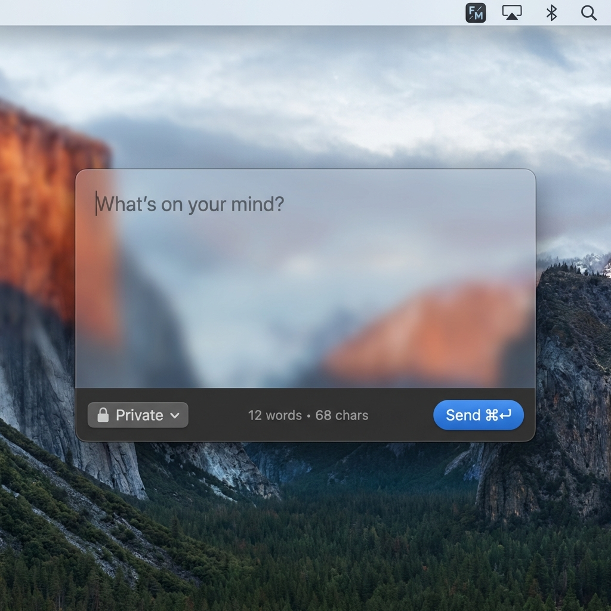

# FastMemos

A lightweight macOS menubar app for quickly capturing notes to your self-hosted [Memos](https://github.com/usememos/memos) instance.



## Features

- 🎯 **Lives in your menubar** - Always accessible, never in the way
- ⌨️ **Global shortcut** - Press `⌘⇧M` anywhere to capture a thought (configurable)
- ⚡ **Instant sync** - `⌘Enter` to push notes to your Memos server
- 🔐 **Secure** - Credentials stored in macOS Keychain
- 📊 **Word count** - Real-time character and word count
- 🔒 **Visibility control** - Set default visibility + override per memo

## Requirements

- macOS 13.0 (Ventura) or later
- A self-hosted [Memos](https://github.com/usememos/memos) instance

## Installation

### Download
Download the latest `.dmg` from [Releases](https://github.com/pawelorzech/FastMemos/releases).

### Build from Source
```bash
git clone https://github.com/pawelorzech/FastMemos.git
cd FastMemos
open FastMemos.xcodeproj
# Build with Xcode (⌘B)
```

## Setup

1. Launch FastMemos - look for the icon in your menubar
2. Click the icon and go to **Settings**
3. Enter your Memos server URL (e.g., `https://memos.yourdomain.com`)
4. Log in with your Memos username and password
5. Configure your preferred default visibility
6. Customize the global shortcut if desired

## Usage

| Action | Shortcut |
|--------|----------|
| Open note window | `⌘⇧M` (default, configurable) |
| Submit note | `⌘Enter` |
| Close without saving | `Escape` |

## Privacy

- Your credentials are stored securely in macOS Keychain
- Notes are sent directly to YOUR server - no third parties
- No analytics, no tracking, no telemetry

## Contributing

Contributions are welcome! Please feel free to submit a Pull Request.

## Feedback

Found a bug or have a feature request? 
- [Open an issue](https://github.com/pawelorzech/FastMemos/issues)
- Email: [pawel@orzech.me](mailto:pawel@orzech.me)

## License

[MIT License](LICENSE) © Paweł Orzech

## Acknowledgments

- [Memos](https://github.com/usememos/memos) - The amazing self-hosted note-taking service
- [HotKey](https://github.com/soffes/HotKey) - Global keyboard shortcuts for macOS
